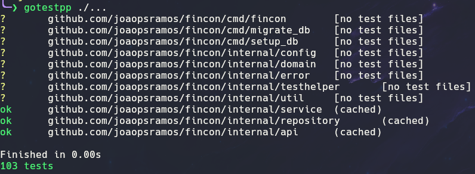
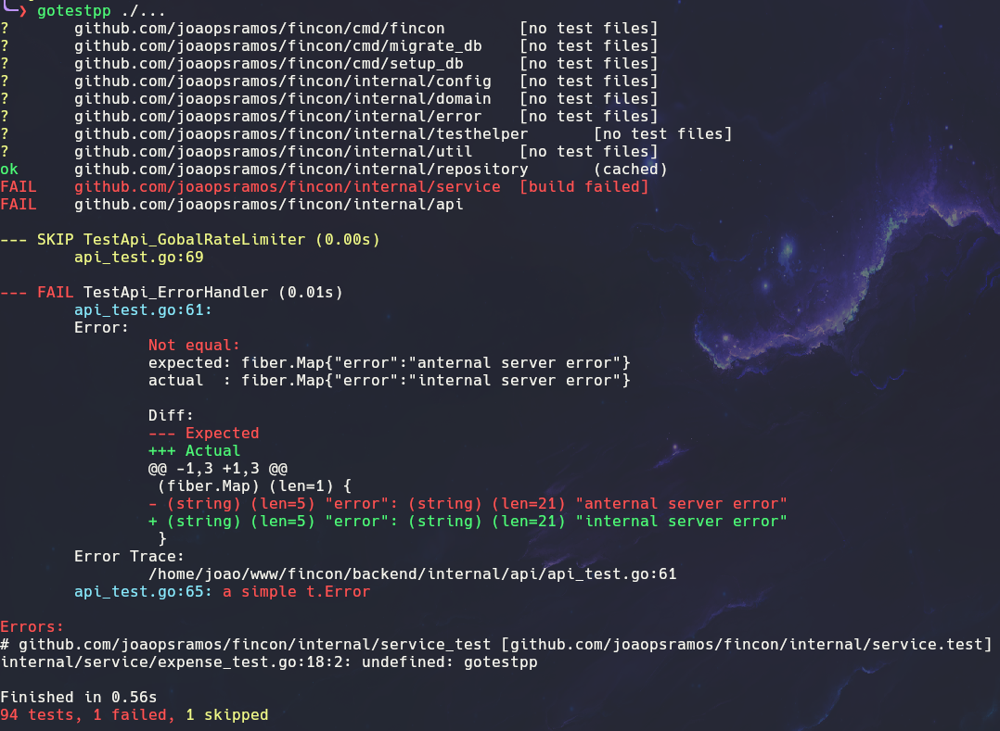

# gotestpp

`gotestpp` (gotest++) runs tests using `go test -json`, prints formatted test output similar to the original
and a summary at the end. Its main purpose is to make test failures easier to understand. It also parses [Testify](https://github.com/stretchr/testify) assertions, adding colors and slightly modifying the output format.

## Features

- Colored output
- Support for testify assertions
- Logs are printed only if they originate from failed tests
- Summary

Print order:

- Passed packages
- Skipped tests
- Failed tests
- Errors (build errors or when `gotestpp` fails to run)
- Summary

## Installation

```sh
go install github.com/joaopsramos/gotestpp@latest
```

## Usage

Simply use `gotestpp` instead of `go test`:

```sh
gotestpp ./...
```

> [!NOTE]
>
> Even though all flags that work with go test are accepted by gotestpp, it does not yet support other outputs (such as benchmarks).

## Output Example

### Success:



### Test failed + build failed:



## Why another tool for this?

There are incredible tools that do something similar, but I wanted one that makes failures easier to understand,
especially by improving (in my opinion, of course) the output of Testify assertions.
